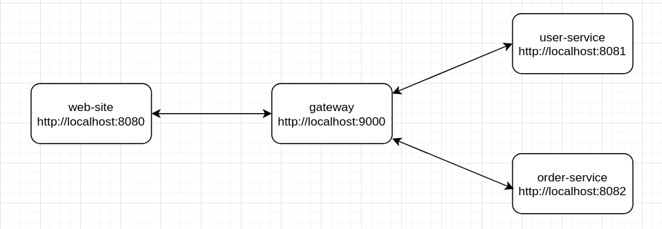
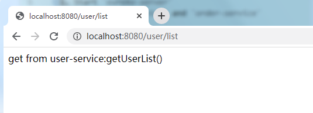
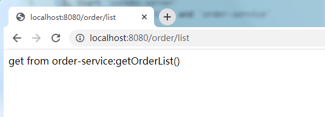

# Spring Cloud Gateway With Eureka

1. Start `eureka-server`
2. Start `user-service` and `order-service`
3. Start `gateway`
4. Start `web-site`
5. Access `web-site`  
http://localhost:8080/user/list  
  
http://localhost:8080/order/list     

