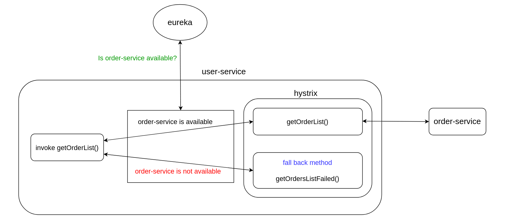
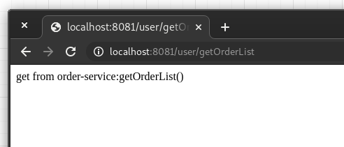
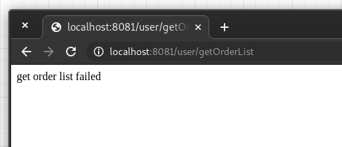

# Spring Cloud Eureka With Hystrix

  
  
1. Start `eureka-server`  
2. Start `order-service` and `user-service`(port:8081)  
3. Test request : from  `user-service` to  `order-service` : http://localhost:8081/user/getOrderList     
request successful:  
  
stop the `order-service`,it goes down(not available) and request failed:  

