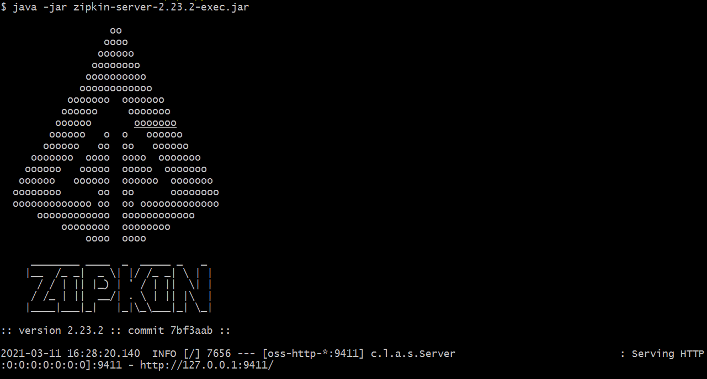

# Spring Cloud Sleuth With Zipkin
  
- sleuth create tracing info and send the data to zipkin
- zipkin collects the tracing data and show info on the UI

1. Start zipkin server,download from `https://repo1.maven.org/maven2/io/zipkin/zipkin-server/2.23.2/zipkin-server-2.23.2-exec.jar`, then run:
`java -jar zipkin-server-2.23.2-exec.jar`
   

   
2. Start `service-a` and `service-b`.

3. Access `service-a` : `http://localhost:8081/service-a/test`

  

4. Open zipkin UI : `http://localhost:9411/zipkin/`:

   